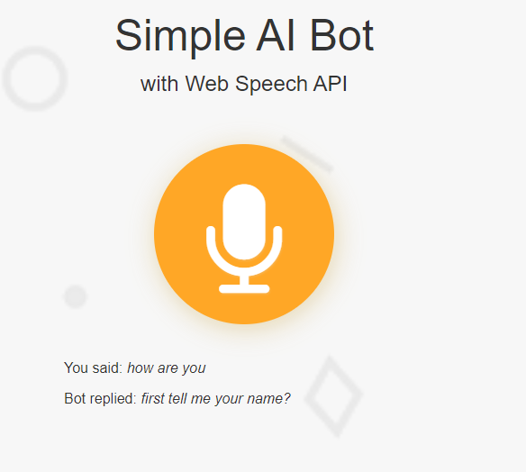

# Web Speech AI Bot

> This is a simple AI bot made with nodejs, web speech api and [dialogflow](https://dialogflow.cloud.google.com/#/getStarted)




This is how web app works:

1. Using the Web Speech API’s SpeechRecognition interface to listen your voice from a microphone.
1. Send your message to dialogflow agent (the natural language processing platform) as a text string.
1. Once the AI from the agent returns the reply text back, use the SpeechSynthesis interface to give it a synthetic voice.

> ### **The full tutorial can be found :point_right:** [Here](https://medium.com/swlh/building-an-ai-chat-bot-with-node-js-and-web-speech-api-93710b25114a)

## Supported Browser

- [Google Chrome](https://google.com)

## Project Setup

```bash
#install dependencies
npm install

#install nodemon
npm install -g nodemon
```

## Setting Up Dialogflow

1. To setup DialogFlow, you’ll need to create a [DialogFlow Account](https://dialogflow.cloud.google.com/#/getStarted).
1. After creating an account, you would need to create an “agent”. The Getting Started guide illustrates all the relevant details
1. Rather than opting for the complete customization method and creating entities and intents, you can just click Small Talk in the left menu.
1. You can then toggle the switch for the service to be enabled.
1. To use the API with our Nodejs application, you’ll need to go to the ‘General Settings’ page (click on the cog icon beside your agent’s name in the menu) and retrieve your Project Id.

## Before You begin

1. [Enable the Dialogflow API](https://console.cloud.google.com/flows/enableapi?apiid=dialogflow.googleapis.com&ref=https://github.com/googleapis/nodejs-dialogflow/blob/master/README.md)
1. [Set up authentication with a service account](https://cloud.google.com/docs/authentication/getting-started) so you can access the API from your local workstation.
1. Click on create service account key page.
1. Download your josn file credentials and put in your root directory.
1. Replace the keyfilename of your json file name in app.js

> Add config.env file inside the config folder and add the following:

```
PORT=5000
NODE_ENV=development
PROJECT_ID=your dialogflow project id
```

## Run App

```bash
#Run in dev mode
npm run dev
#Run in prod mode
npm start
```

- version: 1.0.0
- License: MIT
- author: Sajid Ansari
